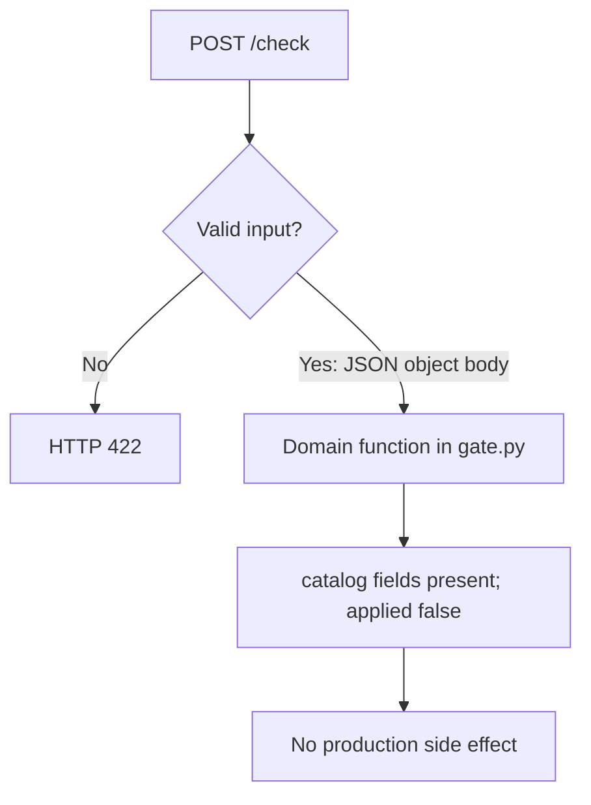

# Self-Service ML Platform: process flows

## Domain request

Endpoint: `POST /check`. Stages summarize [src/ssml/gate.py](../src/ssml/gate.py). This is in-process Python, not a hosted model or production apply.

See [INTERVIEW_QA.md](../INTERVIEW_QA.md) for fixture walkthroughs and [PROJECT_ARCHITECTURE.md](../PROJECT_ARCHITECTURE.md) for the component map.
